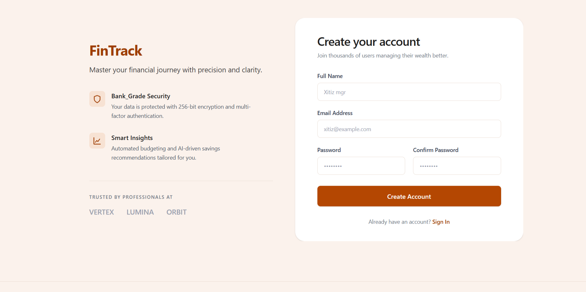
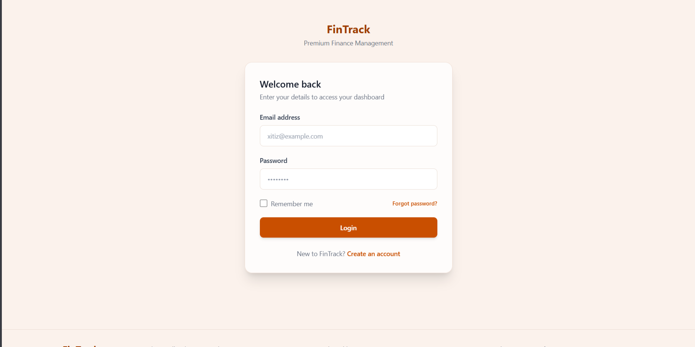
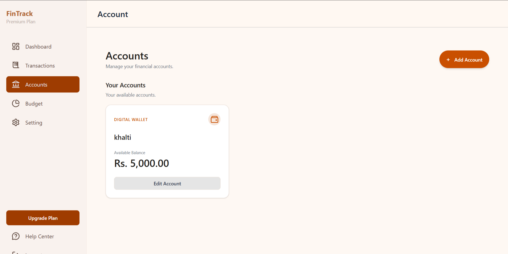
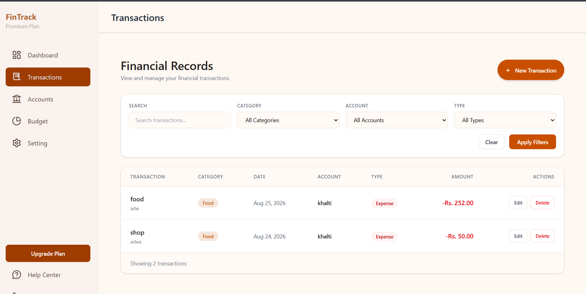
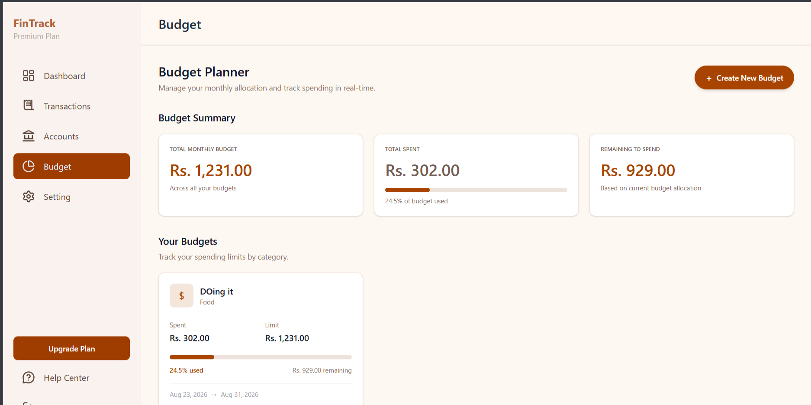
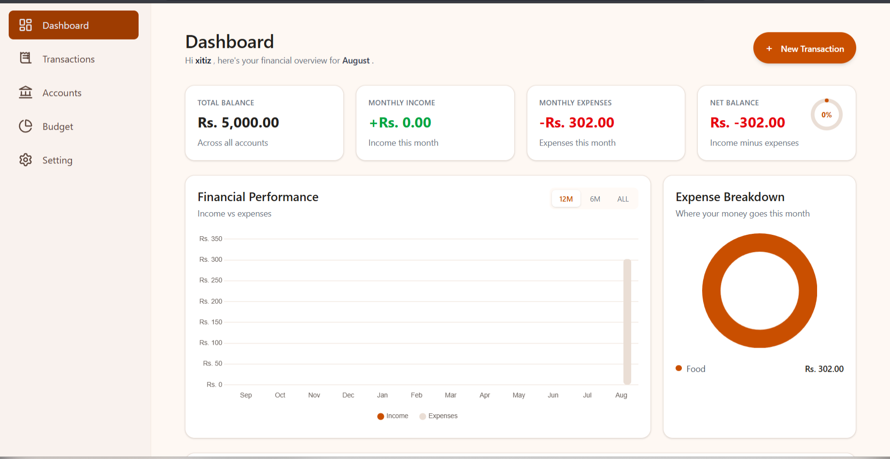
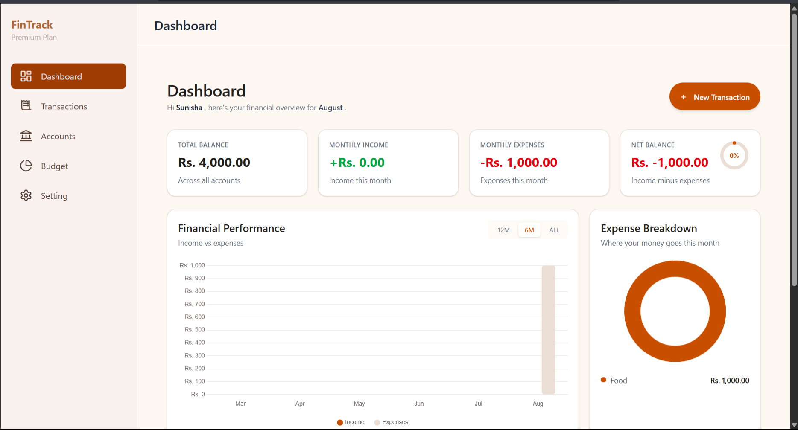
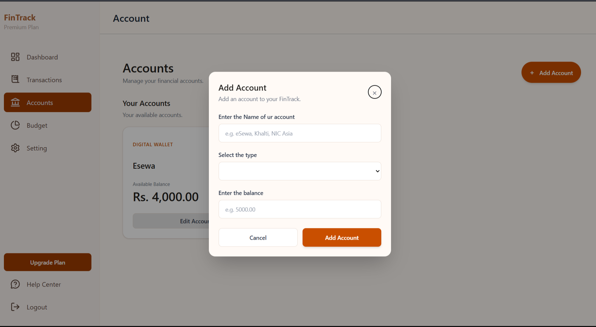
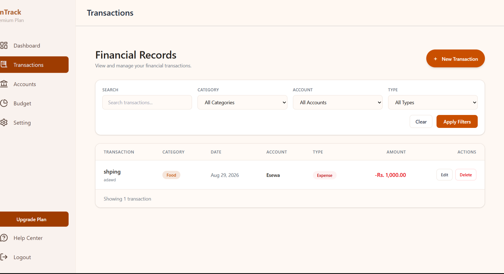

# What is Fintrack
Fintrack is a finance tracking web app which help user to understand  their financial situation,track their income and expense throught their given period of time and help to identify their financial weakness.
# Feature
## Authentication
- where user can register ,login ,logout

- user can also reset there password if they forget 
## Accounts
- dynamic account section where u can add account that u have currently
- user can edit the present account
- For now user cannot delete the account

## Transaction
- User can add there transaction as they like it automatically calculate the transaction amount and deduct from account

## Budget
- User can create a Budget goal for a months or more 

## Dashboard
- The dashboard give the overview of your financial status 
- total income , total expense , total balance ,etc
- it is represent in  a beautiful chart 

# Tech Stack
## Backend
- Python
- Flask
- Flask-Sqlalchemy(as ORM)

## Frontend
- Html 5
- jinja template 
- tailwind css (styling)

## DataBase
- mysql

## Other
- Resend api (for forget password and greating)

# How to use Fintrack ?
-  First u have to register as a u would do on a website with email and creating password.
- login in the register email.
 
- Will be redirected to dashboard all the number will be zero for new user. 
- at the left side bar u will see different section (eg:transaction,account,budget).
- First create an account that u use on daily based like digital wallet (esewa) , mbl banking ,etc.

- After creating account u can add the transaction on that account (the money that u added on the account will decrease as u add transaction of type expense).

- like that u can use FIntrack hope this help :D...

# Runing the project
- Clone the repository
- Create a new virtual environment for the dependency 
python -m venv venv
- Install the dependencies
pip install -r requirements.txt
- Need to add .env file 
after creating env file add all the required environment variables
eg: SECRECT_KEY = "your secrect key"
    RESEND_API_KEY=" your api key"
- Also create the database and make sure the database configuration is correct.
- Then run the project 
python run.py 

# AI usage
- the ui design is made from  google stitch even tho its created from stitch 80% of desing i had to change or remove the feature.
- the content like writing is from google search . 
- the picture in the landing page is generated using google gemini.
- other then that i use chatgpt as a learning and to review my code and for chart in dashboard mainly .

# Addtional information 
So for now the  project is Fintrack v1 TwT.. there are still so many feature that i originally planed but couldnt include so fintrack v1 is created where this is just a simple version of my large imagination hehe 

the original plan was to make fintrack one of the best fainance tracking webapp with the help of ai assistance, automation, receipt scanning, file imports, and more advanced financial analysis.

but because my exam are getting closer , i decided to leave all of this feature and just make a simple v1 first but in version 2 the given feature will be added: 
- AI chatbot for automation 
- receipt scaning 
- file importing like excel and other file 
- UI will be significantly improve 